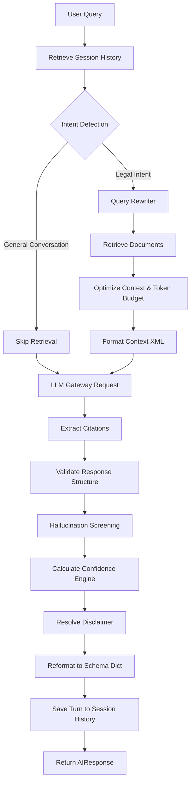

# CrackLaw Legal AI Engine

The Legal AI Engine serves as the core intelligence orchestrator of **CrackLaw**. It handles intent classification, query rewriting, prompt compiling, contextual token budgeting, provider routing, grounding checks, and response validation.

---

## 1. Directory Structure & Key Files

The module is housed under `src/ai/` and comprises the following files:

| File | Description |
| :--- | :--- |
| **`exceptions.py`** | Custom hierarchy for domain exceptions (`CrackLawAIError`, `LLMProviderError`, `ContextError`, etc.). |
| **`ai_models.py`** | Standard dataclasses for serialization (`Message`, `Session`, `AIRequest`, `AIResponse`). |
| **`token_manager.py`** | Token length calculator and trimmer. Falls back to fast, offline heuristics if network is missing. |
| **`prompt_templates.py`** | Modular templates (system, intent detection, user instruction, rewriting) for reasoning tasks. |
| **`prompt_engine.py`** | Compiles dynamic prompts based on intent classifications. |
| **`context_injector.py`** | Formats database search result items into structured XML document blocks. |
| **`context_optimizer.py`** | Prunes context documents to enforce exact token budgets and deduplicate items. |
| **`intent_detector.py`** | Pipeline-based classification combining fast regex matching with LLM verification. |
| **`query_rewriter.py`** | Resolves pronouns and contextual gaps using rolling conversation history. |
| **`llm_gateway.py`** | Direct REST API caller for OpenAI, Anthropic, Gemini, Ollama, and OpenRouter with backoff & caching. |
| **`provider_factory.py`** | Factory to instantiate the specific provider adapter dynamically. |
| **`conversation_memory.py`** | Token-budgeted rolling chat window that preserves system prompts. |
| **`session_manager.py`** | Thread-safe manager for conversational sessions with JSON state export/import capabilities. |
| **`citation_generator.py`** | Scans LLM response text for bracket index references and matches them to source metadata. |
| **`response_validator.py`** | Validates response formatting (unclosed tags, empty strings, index overflows). |
| **`hallucination_detector.py`** | Lexical overlap and LLM NLI fact check to verify grounding in context. |
| **`confidence_engine.py`** | Calculates a composite confidence score (0.0 to 1.0) using retrieval, grounding, and validation. |
| **`disclaimer_engine.py`** | Resolves and appends appropriate intent-based legal disclaimers. |
| **`response_formatter.py`** | Parses markdown responses into a structured dictionary (Summary, Acts, Sections, Citations, Steps). |
| **`ai_service.py`** | Facade orchestrating all modules into a single, cohesive reasoning pipeline. |

---

## 2. Pipeline Flow Chart

Below is the reasoning path taken for a user query:



---

## 3. Configuration Mapping

The engine integrates with the unified `Config` singleton. Below are the key paths in `config.json`:

```json
{
  "retrieval": {
    "top_k": 5,
    "similarity_threshold": 0.25
  },
  "ai": {
    "llm_provider": "gemini",
    "model_name": "gemini-1.5-flash",
    "max_memory_tokens": 4096,
    "max_retries": 3
  }
}
```

Environment variables are used to authenticate connection details:
- OpenAI: `OPENAI_API_KEY`
- Anthropic: `ANTHROPIC_API_KEY`
- Google Gemini: `GEMINI_API_KEY` or `GOOGLE_API_KEY`
- OpenRouter: `OPENROUTER_API_KEY`
- Ollama Host: `OLLAMA_HOST` (Defaults to `http://localhost:11434`)

---

## 4. Verification & Testing

### Running Unit Tests
A mock-based test suite covers all components of the engine, ensuring 100% offline coverage and zero file-permission leakage:
```bash
python -m unittest tests/test_ai_engine.py
```

### Running the Demonstration
To run a complete simulated E2E conversation (NDA review, greeting, follow-up co-reference search):
```bash
python scripts/demo_ai_engine.py
```
