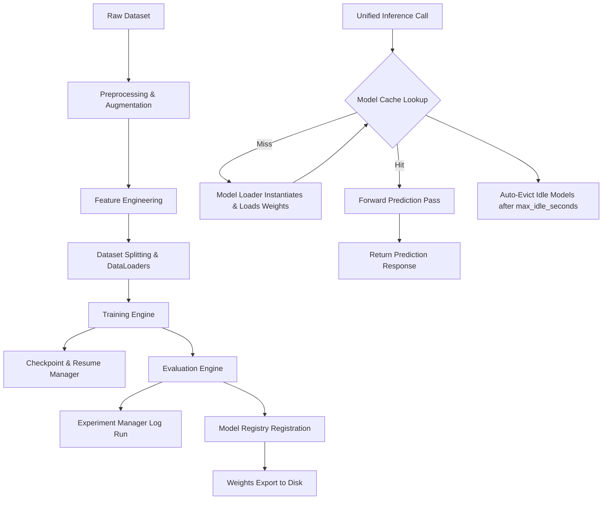

# CrackLaw AI Model Hub

The AI Model Hub is the centralized machine learning and deep learning layer of **CrackLaw**. It handles model architecture definition, dataset ingestion, training execution, evaluation, metrics logging, checkpoint resumption, lazy-loading caching, and unified predictions.

---

## 1. Directory Structure & Key Files

The Model Hub is housed under `src/models/` and comprises the following files:

| File | Description |
| :--- | :--- |
| **`exceptions.py`** | Custom hierarchy for domain exceptions (`ModelHubError`, `ModelNotFoundError`, `TrainingError`, etc.). |
| **`config.py`** | Default hyperparameters, database directories, and target model schema specifications. |
| **`model_registry.py`** | File-backed model catalog tracking model versions, training dates, metrics, and state paths. |
| **`model_factory.py`** | Creates PyTorch neural networks (TextCNN, BiLSTM), Sklearn models, and Keras/TensorFlow emulators. |
| **`model_loader.py`** | Framework-specific weight loading adapters (using Pickle, Torch weight maps, and Keras APIs). |
| **`model_cache.py`** | Lazy loader with timestamped usage tracking and automatic idle model eviction. |
| **`preprocessing.py`** | Cleaners, vocabulary tokenizers, index sequences, and numerical standardizers. |
| **`augmentation.py`** | Noise pipelines for text data (synonym swapping, token deletions) and numerical tables (Gaussian). |
| **`feature_engineering.py`** | Structural legal keyword feature extractor ("shall", "indemnify", document length density). |
| **`dataset_loader.py`** | Splitting inputs into train/val/test and wrapping PyTorch DataLoaders. |
| **`checkpoint_manager.py`** | Save/load state dict variables, epochs, and optimize parameters. Supports automatic resume lookup. |
| **`experiment_manager.py`** | Logs hyperparameter choices, epoch training trajectories, and test outputs to `runs.json`. |
| **`metrics.py`** | Accuracy, Precision, Recall, F1, ROC-AUC, and Confusion Matrix calculation engines. |
| **`training_engine.py`** | Framework-independent training loops with Early Stopping and learning rate schedules. |
| **`evaluation_engine.py`** | Loss trajectory coordinates compiling and markdown reporting. |
| **`inference_engine.py`** | Unified prediction gateway API (`classify()`, `extract_entities()`, `recommend()`, `calculate_risk()`). |
| **`model_hub.py`** | Main orchestrator facade class. |

---

## 2. Model Hub Architecture Workflow



---

## 3. Training & Inference Workflows

### Model Training Workflow
1. Load dataset (JSON/CSV) and instantiate `ModelDatasetLoader`.
2. Extract numerical features using `LegalFeatureExtractor` and scale using `NumericalScaler`.
3. Split the data into train, validation, and test arrays.
4. Call `ModelHub.train_pytorch_model` (or `train_keras_model`, `train_sklearn_model`).
5. During training, checkpoints are saved at each epoch. If training is interrupted, restarting it with `resume=True` automatically picks up from the latest saved epoch.
6. Early stopping halts training once validation loss improvements plateau.
7. The run is logged to `models/experiments/runs.json` and registered as active in `models/model_registry.json`.

### Inference Gateway Workflow
The AI Engine accesses the Model Hub **only** via the unified inference API methods on `ModelHub`:
- **`classify(text, task="intent"|"document")`**:
  - Classifies user intent (e.g., "Contract Review", "Case Search") or document category (e.g., "Civil Law", "Tax Law").
- **`extract_entities(text)`**:
  - Extracts legal entities (Acts, Sections, Courts) using the PyTorch BiLSTM model.
- **`recommend(user_id, user_history)`**:
  - Recommends related cases based on embedding cosine similarity.
- **`calculate_risk(contract_text)`**:
  - Engineers legal features, scales them, and executes risk regression prediction, returning a score (0.0 to 1.0) and severity level (LOW, MEDIUM, HIGH).

---

## 4. Verification & Testing

### Running Unit Tests
A mock-based test suite covers all components of the engine, ensuring 100% offline coverage and zero file-permission leakage:
```bash
python -m unittest tests/test_model_hub.py
```

### Running the Demonstration
To run a complete simulated E2E training, checkpoint saving, metric compilation, lazy loading, and cache unloading run:
```bash
python scripts/demo_model_hub.py
```
